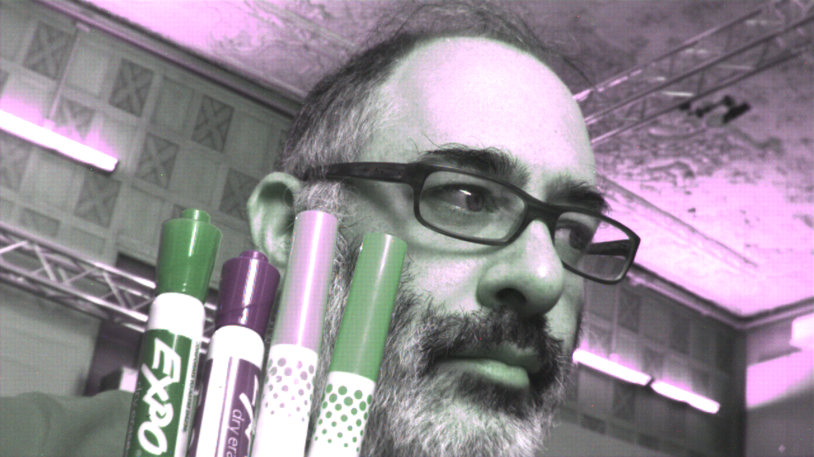
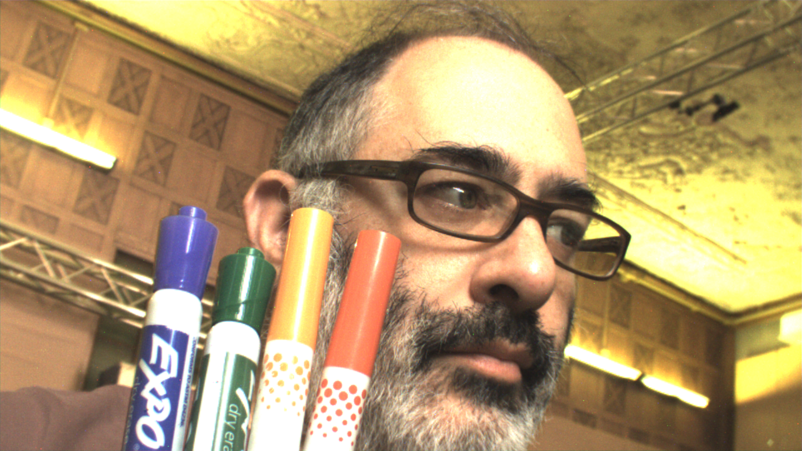

# debayering
Code for converting raw GRBG Bayer images to RGB, using bilinear interpolation. Developed for Processing v.3.3.7 and openFrameworks v.0.10, including versions with GL2 and GL3 shaders. 

Helpful resources: 
* [The Book of Shaders, by Patricio Gonzalez Vivo and Jen Lowe](https://thebookofshaders.com/)
* [Shaders (Processing Shader Tutorial), by Andres Colubri](https://processing.org/tutorials/pshader/)

Additional related links: 
* [bayer2rgb](https://github.com/jdthomas/bayer2rgb)
* [debayer-rpi](https://github.com/rasmus25/debayer-rpi/blob/master/demosaic.frg)
* [McGuire2009Bayer](http://casual-effects.com/research/McGuire2009Bayer/index.html)
* [OF Forum](https://forum.openframeworks.cc/t/solved-ofvideograbber-with-bayer8-pixelformat/15822)

Example input: 

Example output:

